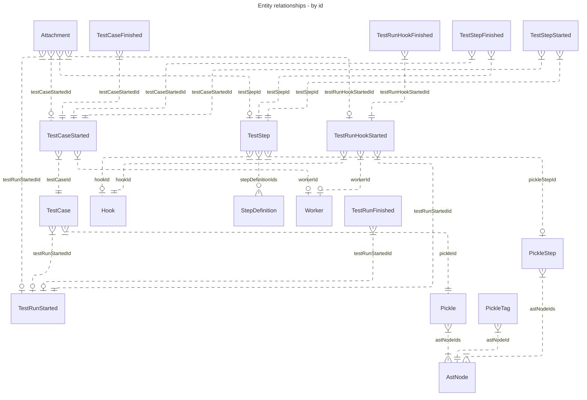
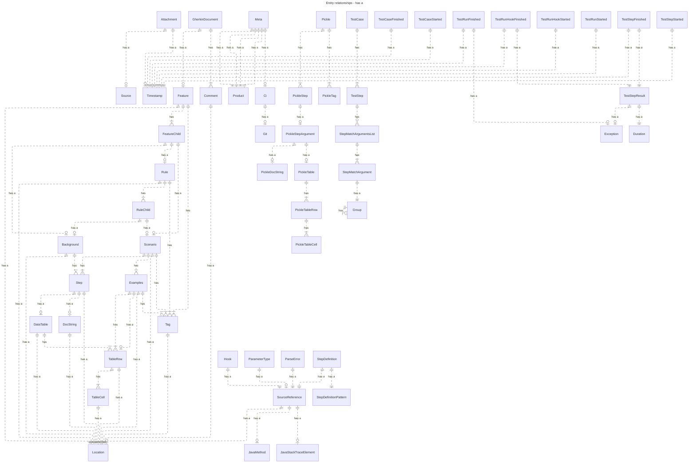

# Cucumber Messages  

All relationships where an entity is referenced by `id`.

Notes:
 * The left side cardinality of the relationship is always rendered as one-or-more, but may also be exactly-one. This can't be extracted from the json schema easily.
 * Worker is not actually an entity in the message protocol, but is referenced by id.
 * `AstNode` is not actually an entity in the message protocol, but does reference an element in the `GherkinDocument`. 

And all has-a relationships, excluding `Envelope`:

