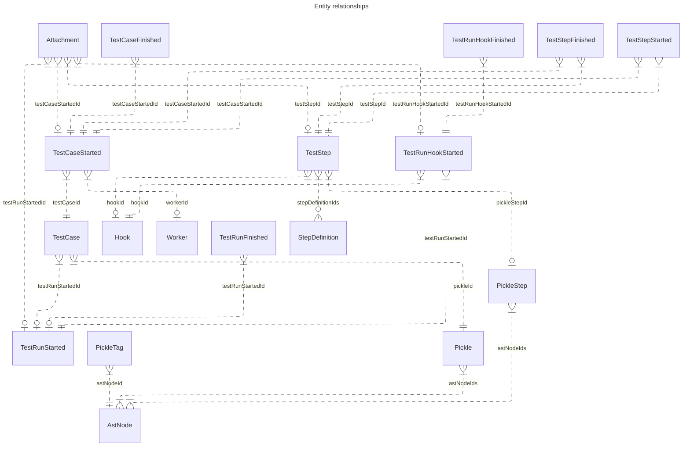

# Cucumber Messages  

All relationships where an entity is referenced by `id`.

Note: The left side cardinality of the relationship is always rendered as one-or-more, but may also be exactly-one. This can't be extracted from the json schema easily.

And all has-a relationships:

```mermaid
erDiagram

Attachment ||..|| Source: has a

Attachment ||..|| Timestamp: has a

Envelope ||..|| Attachment: has a

Envelope ||..|| GherkinDocument: has a

Envelope ||..|| Hook: has a

Envelope ||..|| Meta: has a

Envelope ||..|| ParameterType: has a

Envelope ||..|| ParseError: has a

Envelope ||..|| Pickle: has a

Envelope ||..|| Source: has a

Envelope ||..|| StepDefinition: has a

Envelope ||..|| TestCase: has a

Envelope ||..|| TestCaseFinished: has a

Envelope ||..|| TestCaseStarted: has a

Envelope ||..|| TestRunFinished: has a

Envelope ||..|| TestRunStarted: has a

Envelope ||..|| TestStepFinished: has a

Envelope ||..|| TestStepStarted: has a

Envelope ||..|| TestRunHookStarted: has a

Envelope ||..|| TestRunHookFinished: has a

Envelope ||..|| UndefinedParameterType: has a

GherkinDocument ||..|| Feature: has a

Background ||..|| Location: has a

Comment ||..|| Location: has a

DataTable ||..|| Location: has a

DocString ||..|| Location: has a

Examples ||..|| Location: has a

Examples ||..|| TableRow: has a

Feature ||..|| Location: has a

FeatureChild ||..|| Rule: has a

FeatureChild ||..|| Background: has a

FeatureChild ||..|| Scenario: has a

Rule ||..|| Location: has a

RuleChild ||..|| Background: has a

RuleChild ||..|| Scenario: has a

Scenario ||..|| Location: has a

Step ||..|| Location: has a

Step ||..|| DocString: has a

Step ||..|| DataTable: has a

TableCell ||..|| Location: has a

TableRow ||..|| Location: has a

Tag ||..|| Location: has a

Hook ||..|| SourceReference: has a

Meta ||..|| Product: has a

Meta ||..|| Product: has a

Meta ||..|| Product: has a

Meta ||..|| Product: has a

Meta ||..|| Ci: has a

Ci ||..|| Git: has a

ParameterType ||..|| SourceReference: has a

ParseError ||..|| SourceReference: has a

PickleStep ||..|| PickleStepArgument: has a

PickleStepArgument ||..|| PickleDocString: has a

PickleStepArgument ||..|| PickleTable: has a

SourceReference ||..|| JavaMethod: has a

SourceReference ||..|| JavaStackTraceElement: has a

SourceReference ||..|| Location: has a

StepDefinition ||..|| StepDefinitionPattern: has a

StepDefinition ||..|| SourceReference: has a

StepMatchArgument ||..|| Group: has a

TestCaseFinished ||..|| Timestamp: has a

TestCaseStarted ||..|| Timestamp: has a

TestRunFinished ||..|| Timestamp: has a

TestRunFinished ||..|| Exception: has a

TestRunHookFinished ||..|| TestStepResult: has a

TestRunHookFinished ||..|| Timestamp: has a

TestRunHookStarted ||..|| Timestamp: has a

TestRunStarted ||..|| Timestamp: has a

TestStepFinished ||..|| TestStepResult: has a

TestStepFinished ||..|| Timestamp: has a

TestStepResult ||..|| Duration: has a

TestStepResult ||..|| Exception: has a

TestStepStarted ||..|| Timestamp: has a
```

