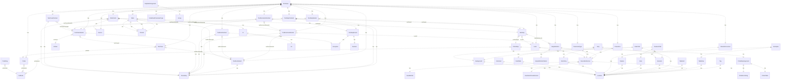

# Cucumber Messages

```mermaid
erDiagram
    direction TB

Attachment }|..|| TestCaseStarted: testCaseStartedId 

Attachment }|..|| TestStep: testStepId 

Attachment }|..|| TestRunStarted: testRunStartedId 

Attachment }|..|| TestRunHookStarted: testRunHookStartedId 

PickleTag }|..|| AstNode: astNodeId 

TestCase }|..|| Pickle: pickleId 

TestCase }|..|| TestRunStarted: testRunStartedId 

TestStep }|..|| Hook: hookId 

TestStep }|..|| PickleStep: pickleStepId 

TestCaseFinished }|..|| TestCaseStarted: testCaseStartedId 

TestCaseStarted }|..|| TestCase: testCaseId 

TestCaseStarted }|..|| Worker: workerId 

TestRunFinished }|..|| TestRunStarted: testRunStartedId 

TestRunHookFinished }|..|| TestRunHookStarted: testRunHookStartedId 

TestRunHookStarted }|..|| TestRunStarted: testRunStartedId 

TestRunHookStarted }|..|| Hook: hookId 

TestStepFinished }|..|| TestCaseStarted: testCaseStartedId 

TestStepFinished }|..|| TestStep: testStepId 

TestStepStarted }|..|| TestCaseStarted: testCaseStartedId 

TestStepStarted }|..|| TestStep: testStepId 


Pickle }|..|{ AstNode: astNodeIds 

PickleStep }|..|{ AstNode: astNodeIds 

TestStep }|..|{ StepDefinition: stepDefinitionIds 


Attachment ||..|| Source: has 

Attachment ||..|| Timestamp: has 

Envelope ||..|| Attachment: has 

Envelope ||..|| GherkinDocument: has 

Envelope ||..|| Hook: has 

Envelope ||..|| Meta: has 

Envelope ||..|| ParameterType: has 

Envelope ||..|| ParseError: has 

Envelope ||..|| Pickle: has 

Envelope ||..|| Source: has 

Envelope ||..|| StepDefinition: has 

Envelope ||..|| TestCase: has 

Envelope ||..|| TestCaseFinished: has 

Envelope ||..|| TestCaseStarted: has 

Envelope ||..|| TestRunFinished: has 

Envelope ||..|| TestRunStarted: has 

Envelope ||..|| TestStepFinished: has 

Envelope ||..|| TestStepStarted: has 

Envelope ||..|| TestRunHookStarted: has 

Envelope ||..|| TestRunHookFinished: has 

Envelope ||..|| UndefinedParameterType: has 

GherkinDocument ||..|| Feature: has 

Background ||..|| Location: has 

Comment ||..|| Location: has 

DataTable ||..|| Location: has 

DocString ||..|| Location: has 

Examples ||..|| Location: has 

Examples ||..|| TableRow: has 

Feature ||..|| Location: has 

FeatureChild ||..|| Rule: has 

FeatureChild ||..|| Background: has 

FeatureChild ||..|| Scenario: has 

Rule ||..|| Location: has 

RuleChild ||..|| Background: has 

RuleChild ||..|| Scenario: has 

Scenario ||..|| Location: has 

Step ||..|| Location: has 

Step ||..|| DocString: has 

Step ||..|| DataTable: has 

TableCell ||..|| Location: has 

TableRow ||..|| Location: has 

Tag ||..|| Location: has 

Hook ||..|| SourceReference: has 

Meta ||..|| Product: has 

Meta ||..|| Product: has 

Meta ||..|| Product: has 

Meta ||..|| Product: has 

Meta ||..|| Ci: has 

Ci ||..|| Git: has 

ParameterType ||..|| SourceReference: has 

ParseError ||..|| SourceReference: has 

PickleStep ||..|| PickleStepArgument: has 

PickleStepArgument ||..|| PickleDocString: has 

PickleStepArgument ||..|| PickleTable: has 

SourceReference ||..|| JavaMethod: has 

SourceReference ||..|| JavaStackTraceElement: has 

SourceReference ||..|| Location: has 

StepDefinition ||..|| StepDefinitionPattern: has 

StepDefinition ||..|| SourceReference: has 

StepMatchArgument ||..|| Group: has 

TestCaseFinished ||..|| Timestamp: has 

TestCaseStarted ||..|| Timestamp: has 

TestRunFinished ||..|| Timestamp: has 

TestRunFinished ||..|| Exception: has 

TestRunHookFinished ||..|| TestStepResult: has 

TestRunHookFinished ||..|| Timestamp: has 

TestRunHookStarted ||..|| Timestamp: has 

TestRunStarted ||..|| Timestamp: has 

TestStepFinished ||..|| TestStepResult: has 

TestStepFinished ||..|| Timestamp: has 

TestStepResult ||..|| Duration: has 

TestStepResult ||..|| Exception: has 

TestStepStarted ||..|| Timestamp: has 
```